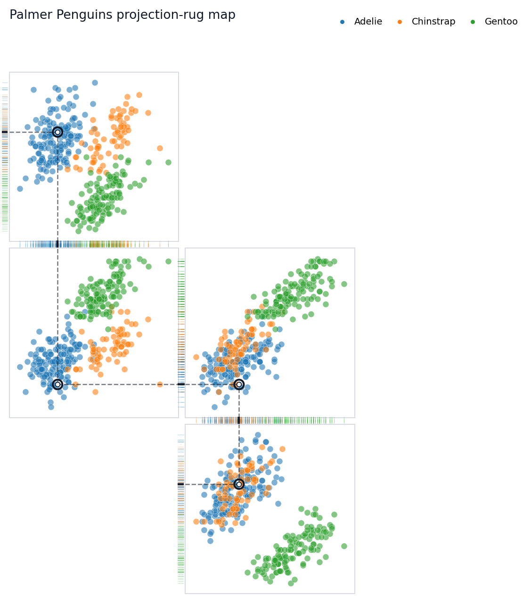

# Rugprint


<!-- WARNING: THIS FILE WAS AUTOGENERATED! DO NOT EDIT! -->

## What it is

Rugprint is a compact projection-rug display for multivariate data. It
arranges selected scatterplot projections in a sparse map and adds edge
rugs to show how the same observations collapse onto each axis.

Before reducing a complex state to one number, look across several
measurements at once.

## Why this is not just a pairplot

A pairplot exhaustively fills a matrix with every pair of variables.
Rugprint is curated: you choose a small set of projections and place
them in a sparse map. Missing cells stay missing; the layout is allowed
to feel like a fingerprint rather than a rectangular matrix.

The edge rugs are part of the structure. In diagram mode, Rugprint
strips away axis furniture by default so narrow rug gutters and local
projection guides carry the explanation.

## Quick start

Load data into a `Rugprint` object, then call `.plot()`. The one-shot
`rugprint(...)` function remains available for quick scripts.

``` python
from rugprint.core import load_penguins, load, rugprint, rank_pair_separation

penguins = load_penguins()
penguins.head()
```

## Palmer Penguins demo

``` python
features = [
    "bill_length_mm",
    "bill_depth_mm",
    "flipper_length_mm",
    "body_mass_g",
]

rank_pair_separation(penguins, features, group="species")
```

``` python
projections = [
    ("bill_length_mm", "bill_depth_mm"),
    ("bill_length_mm", "flipper_length_mm"),
    ("body_mass_g", "flipper_length_mm"),
    ("body_mass_g", "bill_depth_mm"),
]

layout = {
    ("bill_length_mm", "bill_depth_mm"): (0, 1),
    ("bill_length_mm", "flipper_length_mm"): (1, 1),
    ("body_mass_g", "flipper_length_mm"): (1, 2),
    ("body_mass_g", "bill_depth_mm"): (2, 2),
}

rp = load(
    penguins,
    projections=projections,
    layout=layout,
    group="species",
    highlight=0,
    title="Palmer Penguins projection-rug map",
    diagram_mode=True,
    show_axis_labels=False,
    show_tick_labels=False,
    connect_shared_rugs=True,
    connector_style="dotted",
    panel_gap=0.04,
    rug_gap=0.01,
    rug_edges="shared",
)

fig = rp.plot()
```

``` python
from pathlib import Path

figure_dir = Path("figures")
if Path.cwd().name == "nbs":
    figure_dir = Path("..") / figure_dir
figure_dir.mkdir(exist_ok=True)
fig.savefig(
    figure_dir / "rugprint_penguins_demo.png",
    dpi=200,
    bbox_inches="tight",
)
```



## Highlighting one observation

Pass `highlight=` as an integer row position or dataframe index label.
The highlighted row is drawn in every projection with a stronger marker,
local dashed guides from the point to that panel’s rug edges, and darker
rug marks. The demo layout is arranged as a chain of shared variables,
so subtle dotted connectors link the highlighted observation through
each rug gutter from one projection panel to the next.

``` python
fig = rp.with_highlight(12).plot(
    title="Follow one penguin across projections",
)
```

## Ranking projection pairs

`rank_pair_separation` is a lightweight helper for choosing candidate
projections. It computes group centroids for every feature pair and
ranks pairs by their mean between-group centroid distance. It is a
visual suggestion tool, not a statistical test.

``` python
rank_pair_separation(penguins, features, group="species")
```

## Measurement philosophy

Rugprint is meant for moments when one measurement is too thin and a
full matrix is too much. It encourages a small, explicit set of
comparisons: a curated fingerprint of how observations occupy several
measurement spaces at once.
