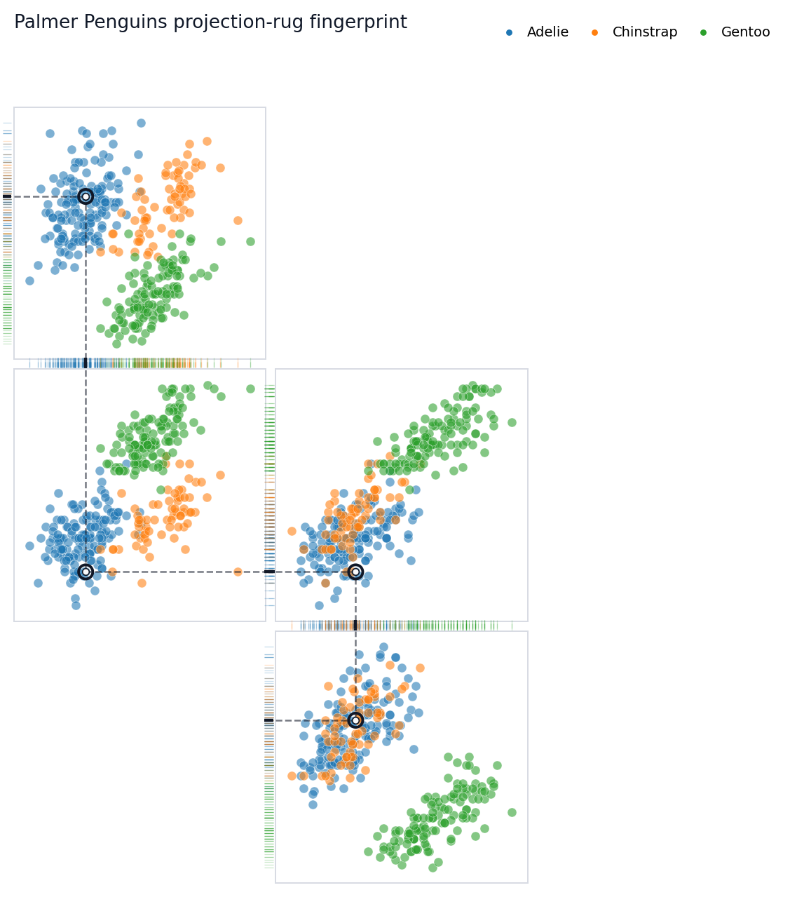
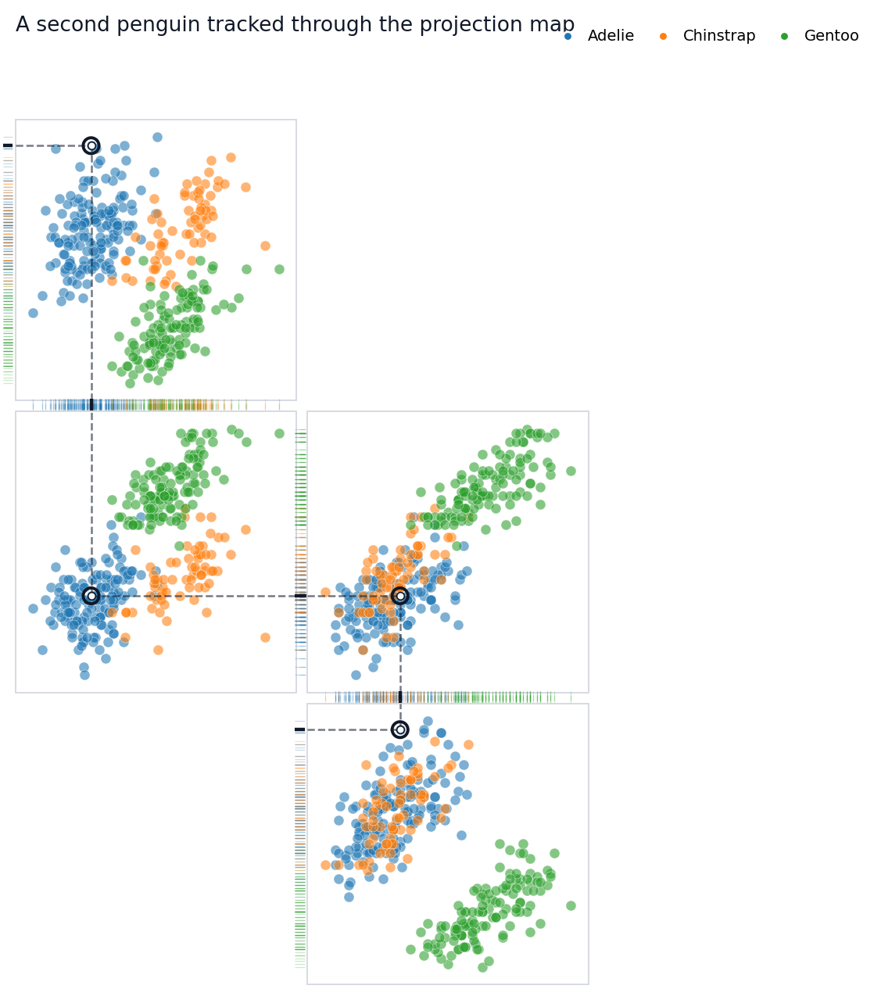
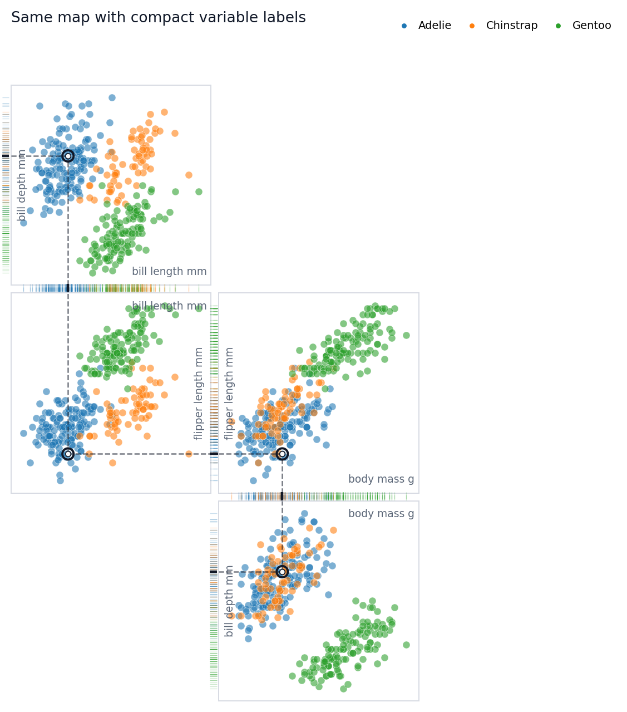
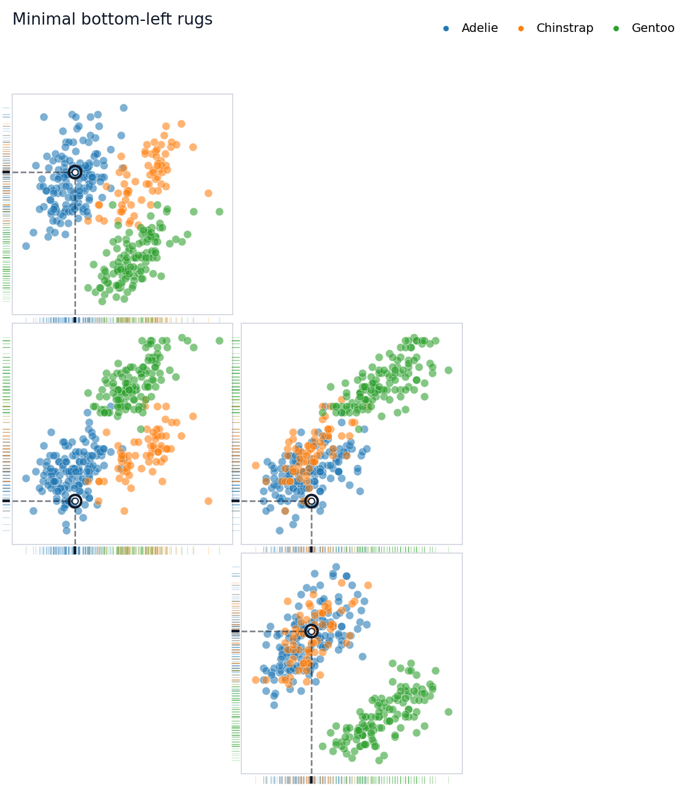

# Palmer Penguins Tutorial


<!-- WARNING: THIS FILE WAS AUTOGENERATED! DO NOT EDIT! -->

This tutorial walks through the object-oriented Rugprint workflow using
the Palmer Penguins dataset. The goal is not to make a complete
pairplot. The goal is to choose a small set of bivariate projections and
arrange them so one highlighted observation can be followed through
shared one-dimensional rugs.

## Setup

Start by loading the demo data and the object-oriented constructor. The
`load(...)` function returns a
[`Rugprint`](https://sangyu.github.io/rugprint/core.html#rugprint)
object; call `.plot()` when you are ready to draw.

``` python
from pathlib import Path

from rugprint.core import load_penguins, load, rugprint, rank_pair_separation

penguins = load_penguins()
penguins.head()
```

<div>
<style scoped>
    .dataframe tbody tr th:only-of-type {
        vertical-align: middle;
    }
&#10;    .dataframe tbody tr th {
        vertical-align: top;
    }
&#10;    .dataframe thead th {
        text-align: right;
    }
</style>

<table class="dataframe" data-quarto-postprocess="true" data-border="1">
<thead>
<tr style="text-align: right;">
<th data-quarto-table-cell-role="th"></th>
<th data-quarto-table-cell-role="th">species</th>
<th data-quarto-table-cell-role="th">island</th>
<th data-quarto-table-cell-role="th">bill_length_mm</th>
<th data-quarto-table-cell-role="th">bill_depth_mm</th>
<th data-quarto-table-cell-role="th">flipper_length_mm</th>
<th data-quarto-table-cell-role="th">body_mass_g</th>
<th data-quarto-table-cell-role="th">sex</th>
<th data-quarto-table-cell-role="th">year</th>
</tr>
</thead>
<tbody>
<tr>
<td data-quarto-table-cell-role="th">0</td>
<td>Adelie</td>
<td>Torgersen</td>
<td>39.1</td>
<td>18.7</td>
<td>181.0</td>
<td>3750.0</td>
<td>male</td>
<td>2007</td>
</tr>
<tr>
<td data-quarto-table-cell-role="th">1</td>
<td>Adelie</td>
<td>Torgersen</td>
<td>39.5</td>
<td>17.4</td>
<td>186.0</td>
<td>3800.0</td>
<td>female</td>
<td>2007</td>
</tr>
<tr>
<td data-quarto-table-cell-role="th">2</td>
<td>Adelie</td>
<td>Torgersen</td>
<td>40.3</td>
<td>18.0</td>
<td>195.0</td>
<td>3250.0</td>
<td>female</td>
<td>2007</td>
</tr>
<tr>
<td data-quarto-table-cell-role="th">3</td>
<td>Adelie</td>
<td>Torgersen</td>
<td>36.7</td>
<td>19.3</td>
<td>193.0</td>
<td>3450.0</td>
<td>female</td>
<td>2007</td>
</tr>
<tr>
<td data-quarto-table-cell-role="th">4</td>
<td>Adelie</td>
<td>Torgersen</td>
<td>39.3</td>
<td>20.6</td>
<td>190.0</td>
<td>3650.0</td>
<td>male</td>
<td>2007</td>
</tr>
</tbody>
</table>

</div>

The cleaned demo dataset keeps the four numeric measurements used
throughout the vignette and drops rows with missing values.

``` python
features = [
    "bill_length_mm",
    "bill_depth_mm",
    "flipper_length_mm",
    "body_mass_g",
]

group = "species"

penguins[features + [group]].describe(include="all")
```

<div>
<style scoped>
    .dataframe tbody tr th:only-of-type {
        vertical-align: middle;
    }
&#10;    .dataframe tbody tr th {
        vertical-align: top;
    }
&#10;    .dataframe thead th {
        text-align: right;
    }
</style>

<table class="dataframe" data-quarto-postprocess="true" data-border="1">
<thead>
<tr style="text-align: right;">
<th data-quarto-table-cell-role="th"></th>
<th data-quarto-table-cell-role="th">bill_length_mm</th>
<th data-quarto-table-cell-role="th">bill_depth_mm</th>
<th data-quarto-table-cell-role="th">flipper_length_mm</th>
<th data-quarto-table-cell-role="th">body_mass_g</th>
<th data-quarto-table-cell-role="th">species</th>
</tr>
</thead>
<tbody>
<tr>
<td data-quarto-table-cell-role="th">count</td>
<td>342.000000</td>
<td>342.000000</td>
<td>342.000000</td>
<td>342.000000</td>
<td>342</td>
</tr>
<tr>
<td data-quarto-table-cell-role="th">unique</td>
<td>NaN</td>
<td>NaN</td>
<td>NaN</td>
<td>NaN</td>
<td>3</td>
</tr>
<tr>
<td data-quarto-table-cell-role="th">top</td>
<td>NaN</td>
<td>NaN</td>
<td>NaN</td>
<td>NaN</td>
<td>Adelie</td>
</tr>
<tr>
<td data-quarto-table-cell-role="th">freq</td>
<td>NaN</td>
<td>NaN</td>
<td>NaN</td>
<td>NaN</td>
<td>151</td>
</tr>
<tr>
<td data-quarto-table-cell-role="th">mean</td>
<td>43.921930</td>
<td>17.151170</td>
<td>200.915205</td>
<td>4201.754386</td>
<td>NaN</td>
</tr>
<tr>
<td data-quarto-table-cell-role="th">std</td>
<td>5.459584</td>
<td>1.974793</td>
<td>14.061714</td>
<td>801.954536</td>
<td>NaN</td>
</tr>
<tr>
<td data-quarto-table-cell-role="th">min</td>
<td>32.100000</td>
<td>13.100000</td>
<td>172.000000</td>
<td>2700.000000</td>
<td>NaN</td>
</tr>
<tr>
<td data-quarto-table-cell-role="th">25%</td>
<td>39.225000</td>
<td>15.600000</td>
<td>190.000000</td>
<td>3550.000000</td>
<td>NaN</td>
</tr>
<tr>
<td data-quarto-table-cell-role="th">50%</td>
<td>44.450000</td>
<td>17.300000</td>
<td>197.000000</td>
<td>4050.000000</td>
<td>NaN</td>
</tr>
<tr>
<td data-quarto-table-cell-role="th">75%</td>
<td>48.500000</td>
<td>18.700000</td>
<td>213.000000</td>
<td>4750.000000</td>
<td>NaN</td>
</tr>
<tr>
<td data-quarto-table-cell-role="th">max</td>
<td>59.600000</td>
<td>21.500000</td>
<td>231.000000</td>
<td>6300.000000</td>
<td>NaN</td>
</tr>
</tbody>
</table>

</div>

## Choose Candidate Projections

`rank_pair_separation(...)` is a lightweight helper. It computes species
centroids for every feature pair and ranks pairs by their mean
between-species centroid distance. This is not a statistical test; it is
a practical way to find projection panels that may separate groups
visually.

``` python
rank_pair_separation(penguins, features, group=group)
```

<div>
<style scoped>
    .dataframe tbody tr th:only-of-type {
        vertical-align: middle;
    }
&#10;    .dataframe tbody tr th {
        vertical-align: top;
    }
&#10;    .dataframe thead th {
        text-align: right;
    }
</style>

<table class="dataframe" data-quarto-postprocess="true" data-border="1">
<thead>
<tr style="text-align: right;">
<th data-quarto-table-cell-role="th"></th>
<th data-quarto-table-cell-role="th">x</th>
<th data-quarto-table-cell-role="th">y</th>
<th data-quarto-table-cell-role="th">mean_centroid_distance</th>
</tr>
</thead>
<tbody>
<tr>
<td data-quarto-table-cell-role="th">0</td>
<td>bill_length_mm</td>
<td>body_mass_g</td>
<td>917.418587</td>
</tr>
<tr>
<td data-quarto-table-cell-role="th">1</td>
<td>flipper_length_mm</td>
<td>body_mass_g</td>
<td>917.224848</td>
</tr>
<tr>
<td data-quarto-table-cell-role="th">2</td>
<td>bill_depth_mm</td>
<td>body_mass_g</td>
<td>916.905540</td>
</tr>
<tr>
<td data-quarto-table-cell-role="th">3</td>
<td>bill_length_mm</td>
<td>flipper_length_mm</td>
<td>20.543409</td>
</tr>
<tr>
<td data-quarto-table-cell-role="th">4</td>
<td>bill_depth_mm</td>
<td>flipper_length_mm</td>
<td>18.316375</td>
</tr>
<tr>
<td data-quarto-table-cell-role="th">5</td>
<td>bill_length_mm</td>
<td>bill_depth_mm</td>
<td>7.689819</td>
</tr>
</tbody>
</table>

</div>

## Design A Sparse Projection Map

A Rugprint layout is a dictionary from projection pair to
`(row, column)`. Missing cells stay empty. For this tutorial, the layout
is a chain of shared variables:

- `bill_length_mm` links the top panel to the center-left panel.
- `flipper_length_mm` links the center-left panel to the center-right
  panel.
- `body_mass_g` links the center-right panel to the lower-right panel.

That chain is what lets the highlighted observation feel continuously
tracked across the map.

``` python
projections = [
    ("bill_length_mm", "bill_depth_mm"),
    ("bill_length_mm", "flipper_length_mm"),
    ("body_mass_g", "flipper_length_mm"),
    ("body_mass_g", "bill_depth_mm"),
]

layout = {
    ("bill_length_mm", "bill_depth_mm"): (0, 1),
    ("bill_length_mm", "flipper_length_mm"): (1, 1),
    ("body_mass_g", "flipper_length_mm"): (1, 2),
    ("body_mass_g", "bill_depth_mm"): (2, 2),
}
```

## Build A Rugprint Object

The object stores the data, projections, layout, group colors, highlight
row, and diagram styling. This makes it easy to reuse the same map while
changing the highlighted observation or plotting options.

``` python
rp = load(
    penguins,
    projections=projections,
    layout=layout,
    group=group,
    highlight=0,
    title="Palmer Penguins projection-rug fingerprint",
    diagram_mode=True,
    show_axis_labels=False,
    show_tick_labels=False,
    connect_shared_rugs=True,
    connector_style="dotted",
    panel_gap=0.04,
    rug_gap=0.01,
    rug_edges="shared",
)

rp
```

    <rugprint.core.Rugprint>

## Draw The Fingerprint

In diagram mode, Rugprint removes most axis furniture by default. The
rugs, local dashed guides, and subtle inter-panel connectors do the
explanatory work.

``` python
fig = rp.plot()
```



``` python
figure_dir = Path("figures")
if Path.cwd().name == "nbs":
    figure_dir = Path("..") / figure_dir
figure_dir.mkdir(exist_ok=True)

fig.savefig(
    figure_dir / "rugprint_penguins_tutorial.png",
    dpi=200,
    bbox_inches="tight",
)
```


## Follow Another Observation

Use `.with_highlight(...)` to keep the same map specification and change
only the tracked observation. This is useful for comparing how
individual penguins reappear across several measurement spaces.

``` python
fig = rp.with_highlight(12).plot(
    title="A second penguin tracked through the projection map",
)
```



You can pass an integer row position or a dataframe index label to
`highlight`. The emphasized point appears in every projection panel.
Local dashed guides show its one-dimensional x and y projections, while
dotted segments in shared rug gutters connect adjacent panels that share
the same variable.

## Add Labels When You Need Them

The default diagram hides axis labels and tick labels because labels can
interrupt rug connections. For explanatory notebooks or presentations,
you may temporarily turn labels back on.

``` python
fig = rp.plot(
    show_axis_labels=True,
    show_tick_labels=False,
    title="Same map with compact variable labels",
)
```



## Rug Edge Modes

`rug_edges` controls which panel edges receive rugs:

- `"shared"`: put rugs on facing edges when adjacent panels share a
  variable.
- `"minimal"`: use bottom x rugs and left y rugs.
- `"outer"`: use bottom x rugs and outer-facing y rugs.
- a dictionary: specify exact edges for each projection.

The default tutorial uses `"shared"` because it makes the highlighted
trace feel continuous.

``` python
fig = rp.plot(
    rug_edges="minimal",
    connect_shared_rugs=False,
    title="Minimal bottom-left rugs",
)
```



## One-Shot Plotting

For quick scripts, the functional wrapper still works. It creates a
[`Rugprint`](https://sangyu.github.io/rugprint/core.html#rugprint)
object internally and immediately calls `.plot()`.

``` python
fig = rugprint(
    penguins,
    projections=projections,
    layout=layout,
    group=group,
    highlight=0,
    title="One-shot Rugprint call",
)
```


## Credit

Rugprint is inspired by Edward R. Tufte’s projection/rug display idea in
*The Visual Display of Quantitative Information* (Graphics Press, 1983).

## Practical Tips

Start with a few projections rather than every pair. Arrange panels so
neighboring projections share one variable. Use `rug_edges="shared"`
when you want the highlighted observation to feel threaded through the
map. If the diagram starts to look like a pairplot, reduce labels and
ticks before adding more panels.
